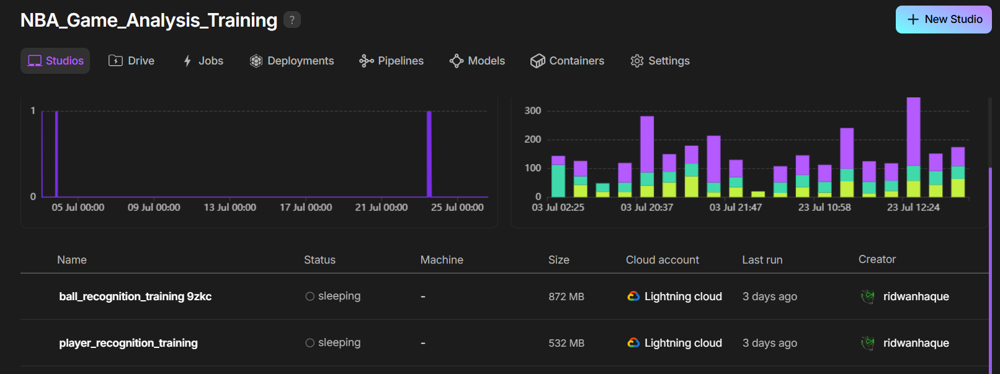
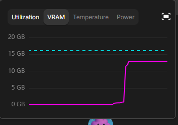
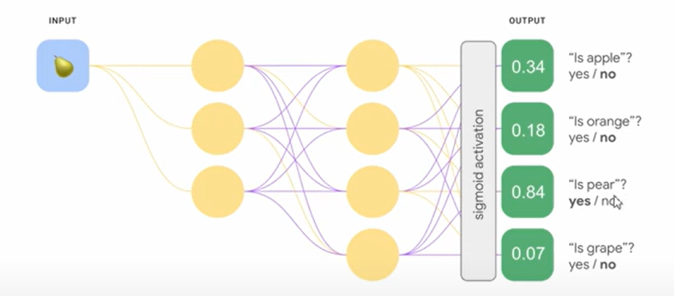
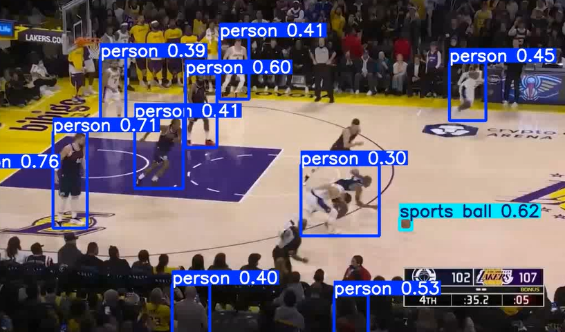
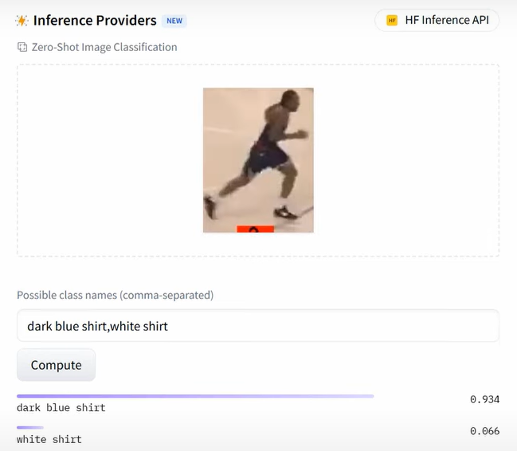
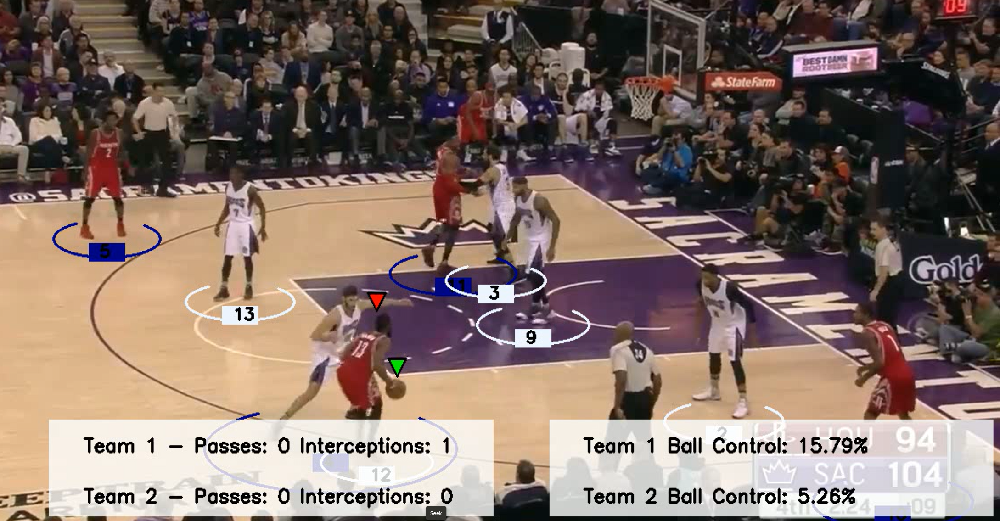

## Documentation 

for model training utilized cloud gpus from google cloud Platform
- 4 CPUs 
- 1 T4 GPU

# Research 

- video 1 (speed distance ball aquisition)
- video 2 (passes logic)
- video 3 (intercepting ball logic and passes)

- used to develop project. 
- focus on different videos 

- locating different objects in frame and identify them

# Image Classification/Recognition 
(what is inside of an image) 
- usually have predefined list of classes 
- model has ability to produce one of those four classes
- prduces a number/index like 0 -4 to identify object

# Image Localization
- produces 4 numbers and they indicate the rectangle around object
- model doesnt draw the rectangle it produces 4 numbers (position of the rectangle and the size)
- middle of rectangle position is (x,y) (width x , height y)
- preproccesing function after recieving output from the model we can draw bounding box
- functions in openCV take two main points (top left and bottom right) to identify rectangle location and size
- (x1,y1) (x2,y2)

# Object Detection 
- identifies what is an object in image and title of object
- different classes for different objects (player) (ball)
- each would have bounding box

- object locations tracked over frames using object detection framework/model (YOLO)

# YOLO Model Architecture (V1 - V11) (Computer Vision Model)
- process image once and produce multiple boxes

# Ultralytics 
- computer vision model library 
- includes YOLO Models
- This is a python Library 

## Workflow Overview
The detection script operates through a sequence of automated steps, from model acquisition to video output.

Model Initialization and Caching
Upon its initial execution, the script automatically fetches the pre-trained YOLOv8 model from the Ultralytics hub. This model is downloaded and saved locally within the project directory, ensuring it is readily available for all subsequent runs without needing to be downloaded again.

Frame-by-Frame Video Processing
The model processes the input video sequentially, one frame at a time, rather than loading the entire video into memory. For each frame, it performs the following steps:

Isolates the single frame as an image.

Runs the object detection inference to identify objects and their bounding boxes.

Proceeds to the next frame to repeat the process until the video is complete.

Output and Results

Console Logs: The detection results for each frame, including bounding box coordinates and class predictions, are stored in a results object and printed to the console for real-time monitoring.

Saved Video: When the save=True parameter is set, the script automatically generates a runs/detect/predict/ directory. The final processed video, with the detection results visually rendered onto each frame, is saved within this folder.

Related
On first run, the script fetches the YOLoV8 model from Ultralytics and downloads it into your project folder
The model processes each video frame individually, not the entire video at once
For each frame, it detects objects and outputs bounding boxes, which are stored in "results"
Results are printed out for review
With save=true, a "runs" folder is automatically created containing the output detection video

## First Test

- number next to the object label is the confidence number (how confident is the model that this is actually a "person" object )
- problems:
    picking up crowd, 
    misclassification of objects,
    basketball isn't always detected

## Next steps

- Accuracy needs to improved through fine tuning already trained model (give it examples with labels (labeled dataset) and allow model to execute similar output by learning)
- this is transferred learning 

# Labeled Datasets w/ RoboFlow
- single image with bounding boxes on players and other scene objects and labeling it
- also labeling scoreboard overlay
- dataset is a list of images labeled according to our specific needs
- roboflow allows us to use existing datasets and retrieve them, more images means more accuracy and stable performance
- the dataset has multiple classes (Player, Referee, Basketball)

# Added Notebooks folder for training
- optimal to run this on a capable machine. we will upload code via collab

# Player Team Assignment with Zero Shot Classification

- goal is to have a neural network that can analyze image and identify jersey color on player objects

input into the neural network and output would be composed of predefined list of classes 
the defined list of classes are from a training set. if a model was trained on 10000 images and there were 4 fruits each with 2000 images 
each image had label and then trained with the dataset for image classification

we need a model that extracts colors from image to make a classification which is difficult to find

so we use classifier w/o any data  (zero shot classifier) which intakes image (premise) and class name (Hypothesis)
this neural network does not produce an infinite number of labels and only produces 3:

- entailment (correct)
- neutral (the hypothesis(input) has little relation to the premise/input image)
- contradiction (incorrect)

# Hugging Face model library
image classification model we are using is fashion clip model 
it analyzes what the user is wearing and makes a class classification 

we need to preprocess the image of our jerseys to fit the model
we have to load the model and the preproccesor. we call preprocessor and pass in class names and we give in the images
it will then return **Pytorch Tensors** . pytorch is a library for machine learning models and deep learning models. 
we will be interacting with the model we've selected through **Transformers**(the library name for hugging face).

the outputs of the model we would take the one with the higher score

## Ball Acquisition 

- basically model will measure if the bounding box of the ball has a >80% overlap with the bounding box of the player then that would indicate a player posseses the ball

## Court Key Point Detection

neural network that outputs numbers relative to the frame
Setting this up allows us to track player position and speed 

I utilized computer vision pose model that is fine tuned through reinforced learning using lightning AI 
We will train model on nba court keypoint detection dataset 

https://universe.roboflow.com/fyp-3bwmg/reloc2-den7l

